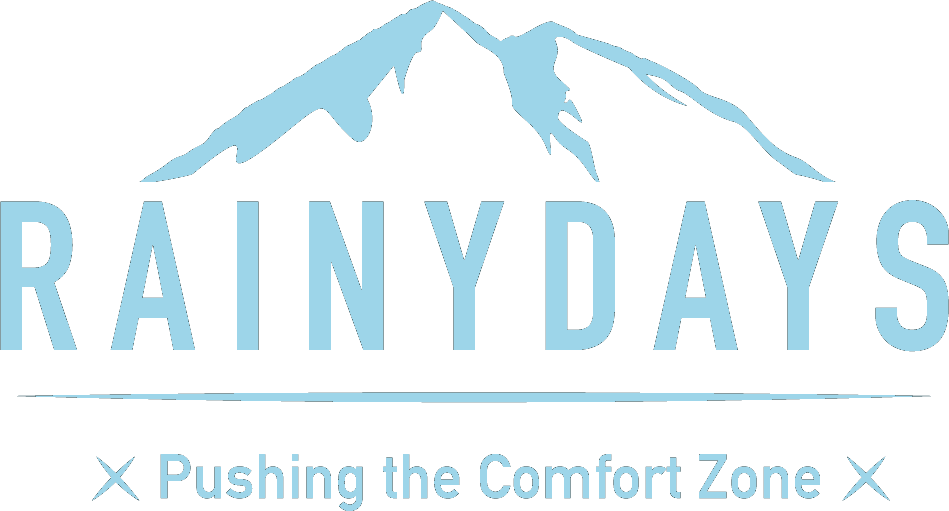

# RainyDays



This project is an e-commerce website.

## Description
The RainyDays project is an e-commerce site where you can explore and shop rain jackets. Ordering section of the products is provided by WooComerce plugin, WordPress.

## Built With

This project has been made interactiv, and for that I have been using:

- HTML(https://developer.mozilla.org/en-US/docs/Web/HTML)
- CSS (https://developer.mozilla.org/en-US/docs/Web/CSS)
- JavaScript (https://developer.mozilla.org/en-US/docs/Web/JavaScript)
- WordPress REST API(https://developer.wordpress.org/rest-api/)

## Getting Started

### Installing

1. Clone the repo:

```bash
git clone git@github.com:vanya992/Blissful-Nirvana.git
```

2. Install the dependencies:

```bash
npm install
```

### Running

To run the app, run the following commands:

```bash
npm run start
```

## Contributing

Feel free to open a disscusion about changes you would like to make to this project.

## Contact


You can contact me through my linkedin profile: (https://www.linkedin.com/in/vladimira-dmitrovic-090183249/);

or my facebook profile: (https://www.facebook.com/vladimira.dmitrovic.3/?paipv=0&eav=AfYrucvWHIWhHK13qWGSMc6MRoXYCayHsoaKkQBs9Esp-NXJg0XdZYfkbJNqoGlJ3SE&_rdr)

